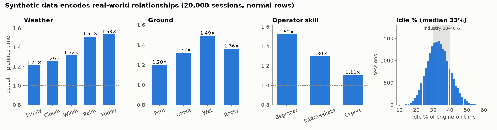
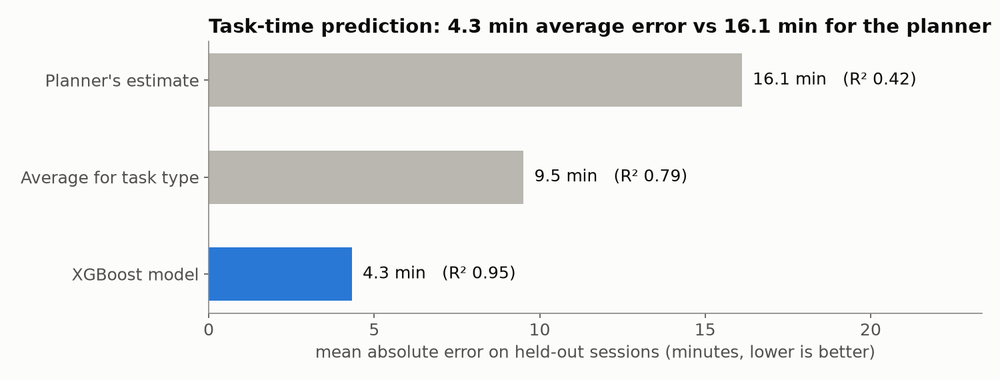
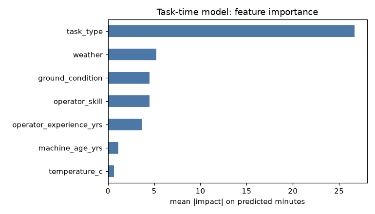
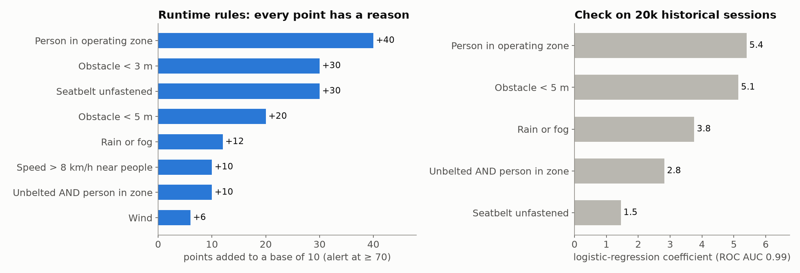
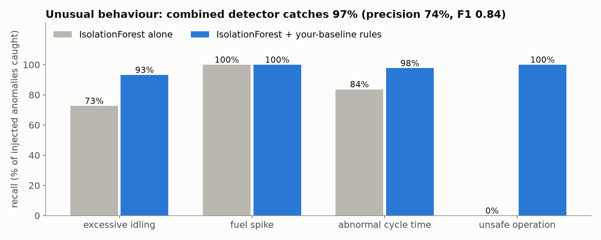

# ML Report — Smart Operator Assistant

For judges and interviewers. Every number below comes from `ml/reports/*.json`, `ml/artifacts/*.json` or the generator output (seed 42, 20,000 sessions). To reproduce all of them:

```
python data/generate.py --rows 20000 --seed 42
python ml/train_task_time.py && python ml/train_safety.py && python ml/train_anomaly.py
python ml/make_slides.py
```

The assistant is **decision support only**. It predicts, detects, explains and recommends; it never controls the machine.

---

## 1. Data: why synthetic, and what it encodes

**Why synthetic.** We have no access to real CAT telematics, and a one-day build needs data with known ground truth so we can *measure* whether the models find what is really there. The CSV contract (`docs/ARCHITECTURE.md` §4.2) mirrors telematics-style fields (fuel used, idle time, load cycles, payload, seatbelt, proximity), so a real Product Link / VisionLink-style feed could replace the generator without changing the app.

**Grounding.** Telematics studies commonly report that heavy equipment idles roughly **30–40% of engine hours**, and idle reduction is one of the biggest fuel-saving levers on a site. Our fleet's median idle share is **33%** of engine-on time, inside that band.

**Relationships built into the generator** (`data/generate.py`). Each is deliberate, so each can be explained:

| Relationship | How it is encoded |
|---|---|
| Skill slows or speeds work | Time × 1.25 Beginner, 1.05 Intermediate, 0.90 Expert (±4% per operator) |
| Weather slows work | × 1.00 Sunny, 1.05 Cloudy, 1.10 Windy, 1.20 Rainy, 1.25 Foggy |
| Ground slows work | × 1.00 Firm, 1.08 Loose, 1.12 Rocky, 1.15 Wet |
| Rain makes ground wet | Wet ground on 60% of rainy days, 30% of foggy days, 10% otherwise |
| Season | Rain is likelier further back in the 90 days (monsoon easing) |
| Older machines are slower and thirstier | +1% time and +1.5% fuel per year of age |
| Heat | Above 38 °C adds 5% to task time |
| Operators have habits | Fixed per operator: idle share (Beginners higher) and chance of an unfastened seatbelt (Beginners 6–12%, Experts 2–5%) |
| Machines do different jobs | Excavators dig, trench, demolish; loaders load; graders grade; dozers grade and dig |
| Fuel follows work | Working burn 12–19 L/h by task, idle ~3 L/h |
| Risk follows the safety rules | Same factors and weights as the safety engine (§3), plus small noise |
| Anomalies with clear signatures | ~4% of rows: idle × 2.5–3.5, fuel × 1.8–2.5, cycles × 0.3–0.5, or unbelted + person < 3 m |

**Result:** 20,000 sessions, **3.9% anomalies** (214 idling, 192 cycle time, 191 fuel spike, 174 unsafe), **9.2% safety alerts**. The demo operator OP1001 idles **37.5%** of engine time against a fleet median of **33.0%**, so "your usual idle" is believable in the demo.



*How to read it:* each bar is actual ÷ planned time averaged over normal sessions. Even "Sunny" sits above 1.0 because every bar also carries the other factors (skill mix, machine age, ground). The planner's flat estimates are systematically optimistic, which is exactly the gap the model closes.

---

## 2. Task-time model

**Question:** how long will this task take, *before it starts*?

**Features (7):** task type, operator skill, operator experience, machine age, weather, ground condition, temperature. Categoricals are one-hot encoded in a fixed, saved column order.

**Deliberately excluded (leakage):** fuel used, idle time, load cycles and actual time. They are only known *after* the task, so a model that used them would score well offline and be useless for planning.

**Model:** XGBoost regressor (300 trees, depth 5, learning rate 0.05), 80/20 split, seed 42.

| Predictor (4,000 held-out sessions) | MAE (min) | RMSE (min) | R² |
|---|---|---|---|
| Planner's estimate (`estimated_time_min`) | 16.1 | 21.0 | 0.42 |
| Average for the task type | 9.5 | 12.6 | 0.79 |
| **XGBoost** | **4.3** | **5.9** | **0.95** |

The model's average error is **less than half** the best simple baseline and about a quarter of the planner's.



**Uncertainty band:** ±1.28 × residual standard deviation (5.94 min) ≈ **±7.6 min**, roughly an 80% interval.

**Feature importance** (mean |impact| on the prediction, minutes): task type 26.7, weather 5.3, ground 4.5, skill 4.5, experience 3.7, machine age 1.1, temperature 0.6. Experience scores even though the generator never uses it directly, because it is strongly correlated with skill. That's worth saying honestly if asked.



**Example explanation** (T002: Trenching, Intermediate operator, 4 yrs, 27 °C):

| Conditions | Prediction | Top factors |
|---|---|---|
| Rainy, Wet ground | **66.7 min** (59.1–74.3) | Rainy weather +6.1 · Wet ground +4.7 · Intermediate operator −2.8 |
| Sunny, Firm ground | **49.9 min** (42.3–57.5) | Firm ground −3.8 · Sunny weather −3.4 · Intermediate operator −2.5 |

The ~17-minute difference is explained factor by factor. Factors come from XGBoost's per-prediction contributions (`pred_contribs`), with one-hot columns summed back to their original feature. Task type is left out of the factor list because it is already shown as the historical average (59.0 min for Trenching).

---

## 3. Safety engine

**Why rules, not a black box.** An operator being told to stop needs to know *why*, instantly, in plain words. Every point of the risk score maps to a factor with a label built from live values (for example "Person detected within 4.2 m of operating zone").

| Factor | Points |
|---|---|
| Base score | 10 |
| Person in operating zone | +40 |
| Obstacle < 3 m (replaces < 5 m) | +30 |
| Seatbelt unfastened, engine on | +30 |
| Obstacle < 5 m | +20 |
| Rain or fog | +12 |
| Unbelted AND person in zone | +10 |
| Speed > 8 km/h near people | +10 |
| Wind | +6 |

Levels: **LOW < 40, MEDIUM 40–69, HIGH ≥ 70**. HIGH raises an alert and an incident. The recommended action comes from the top factor, e.g. "Stop swing movement, sound horn and wait for the zone to clear."

**Test states:**

| State | Score | Level |
|---|---|---|
| All clear | 10 | LOW |
| Seatbelt only | 40 | MEDIUM |
| Person at 4 m | 70 | HIGH |
| Person at 2 m + unbelted + rain | 100 | HIGH |
| Person in zone at 12 km/h (6.5 m) | 60 | MEDIUM |

**Check against history.** A logistic regression on 20,000 sessions (target: alert triggered) reaches **accuracy 0.96, ROC AUC 0.99**. Its coefficients agree that a person in the zone matters most (5.4). Two differences, both explainable:

- **Obstacle < 5 m gets 5.1**, nearly as much as a person in the zone. In the history the two are almost always true together (correlation 0.999), so the regression can't separate them and splits the credit.
- **Seatbelt alone gets only 1.5.** The target is the *alert*, and an unfastened seatbelt alone scores 10 + 30 = 40, never reaching 70. It only tips a session into an alert together with a person in the zone, which is why the interaction term (2.8) carries part of its weight.

The rules stay the runtime source of truth; the regression is evidence the weights are sensible.



---

## 4. Unusual behaviour detection

**Why unsupervised.** Real sites rarely label anomalies; nobody tags "this shift was wasteful". IsolationForest learns what normal looks like from unlabelled sessions. We only use our injected labels to *measure* it.

**Features** (computable from both a history row and the live machine state): idle % of engine time, fuel rate (L/h), cycle time (s), fuel per cycle (L), plus task type (behaviour differs by task).

**Hybrid detector:**
1. `StandardScaler` + `IsolationForest` (200 trees, contamination 3.9% = observed rate) gives a 0–1 "how unusual" score.
2. **Ratio rules against the operator's own baseline** (median per operator and task type) decide the type and the message: idle time > 2× usual or idle % > 1.8× usual → excessive idling; fuel rate > 1.6× → fuel spike; cycle time > 2× → abnormal cycle time; unbelted + person in zone + < 3 m → unsafe operation.
3. Report if a rule fires, or if the IsolationForest score is high **and** some ratio is at least 1.3× usual.

So "excessive" means excessive **for you**, not for the fleet average.

| Held-out 4,000 sessions | Precision | Recall | F1 | Flagged |
|---|---|---|---|---|
| IsolationForest alone | 66% | 68% | 0.67 | 4.0% |
| **Hybrid (IF + your-baseline rules)** | **74%** | **97%** | **0.84** | 5.1% |

| Recall by type | IF alone | Hybrid |
|---|---|---|
| Excessive idling | 73% | 93% |
| Fuel spike | 100% | 100% |
| Abnormal cycle time | 84% | 98% |
| Unsafe operation | 0% | 100% |

The hybrid also names the **correct type for 97%** of true anomalies. IsolationForest alone cannot see unsafe operation at all, because it's a safety pattern, not a behaviour pattern; the rule catches it. The cost is some false alarms: 5.1% of sessions flagged against a true rate of 3.9%.



**Example messages:** "Idle time 130 min vs your usual 44 min this session" · "Fuel burn 28.5 L/h vs your usual 11.9 L/h" · "Operating unbelted with a person 2.2 m away (limit 3 m)".

**Training recommendations** close the loop. Each anomaly or incident maps to a module (excessive idling → Fuel-Efficient Operation; proximity hazard → Working Near People; rain incidents → Wet-Weather Operation). Priority is high when an event is high severity or repeats. Remaining slots are filled with the operator's weakest area versus the fleet.

---

## 5. Limitations and next steps

- **Synthetic data.** Relationships are ones we chose, so the models partly rediscover our assumptions. Next: train on real CAT telematics (Product Link / VisionLink-style); the CSV contract is ready for it.
- **Retraining pipeline.** Models are trained once, offline. Next: scheduled retraining on new sessions, drift monitoring, and versioned artifacts (the backend already loads by file and falls back to rules per function).
- **Per-machine-model calibration.** Machine type and model are not features yet, only age. Next: calibrate time and fuel per model (320 GC vs 336, loaders vs excavators).
- **Seatbelt and people detection.** Today these come from simulated telemetry. Next: cab and perimeter cameras (computer vision) feeding the *same* safety engine inputs, so the rules and explanations don't change.
- **Band width.** The ±7.6 min band is a fixed width. A proportional or per-task band (quantile regression) would be tighter for short tasks.
- **False alarms.** 74% precision is fine for a coaching tool but would need tuning (per-operator thresholds, persistence over several readings) before alerting supervisors.
